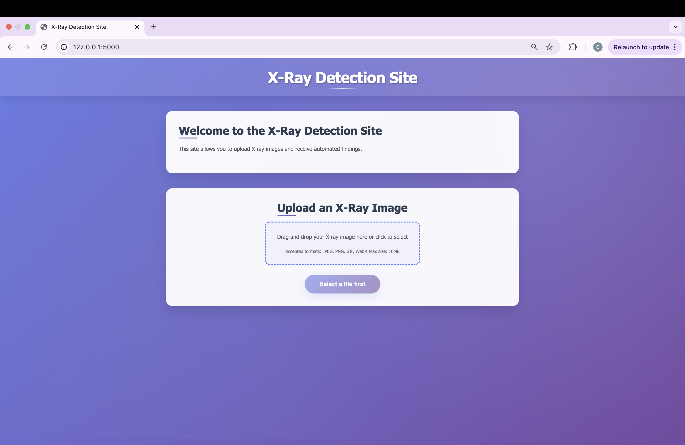

# Chest X-ray Disease Detection with Deep Learning

This project implements a multi-label classification system for detecting various diseases and conditions in chest X-ray images using deep learning techniques. The system is capable of identifying multiple findings simultaneously from a single X-ray image.

## Project Overview

The project uses the NIH Chest X-ray dataset and implements two different approaches:
1. **Custom CNN Model**: A simple convolutional neural network built from scratch
2. **Transfer Learning Model**: Using pre-trained Xception model for better performance

## Features

- **Multi-label Classification**: Detects multiple diseases/conditions simultaneously
- **Grad-CAM Visualization**: Generates heatmaps showing which parts of the X-ray the model focuses on
- **Transfer Learning**: Leverages pre-trained Xception model for improved accuracy
- **Custom Data Generator**: Handles multi-label data efficiently with proper normalization
- **Web Interface**: Flask-based web application for easy image upload and analysis
- **Real-time Prediction**: Immediate results with visual explanations via Grad-CAM overlays
- **Database Integration**: Stores upload history and detection results
- **Cross-platform Support**: Web application with native iOS and Android apps in development

## Dataset

The project uses the NIH Chest X-ray dataset, which contains:
- Chest X-ray images from the NIH Clinical Center
- Multiple disease labels per image (multi-label classification)
- 15 different disease categories including:
  - Atelectasis
  - Cardiomegaly
  - Effusion
  - Infiltration
  - Mass
  - Nodule
  - Pneumonia
  - Pneumothorax
  - And more...

## Project Structure

```
├── sample/
│   ├── images/           # Original X-ray images
│   └── sample_labels.csv # Labels for each image
├── resized_images/       # Preprocessed 224x224 images organized by disease
├── xray_detection_model.keras          # Custom CNN model
├── xray_detection_transfer_model.keras # Transfer learning model
├── xraydetectionsite/   # Flask web application
│   ├── flaskr/
│   │   ├── home.py      # Main route handlers
│   │   ├── detection.py # Model prediction and Grad-CAM functions
│   │   ├── static/
│   │   │   └── uploads/ # Uploaded X-ray images and results
│   │   └── templates/
│   │       └── home/
│   │           ├── index.html # Upload interface
│   │           └── result.html # Results display
│   └── db.py            # Database configuration
├── training.ipynb       # Jupyter notebook with training code
├── Xrayhomeshot.png     # Screenshot of web interface
├── Xrayresultshot.png   # Screenshot of results page
├── xrayhomeuploadshot.png # Screenshot of upload interface
└── README.md
```

## Key Components

### 1. Data Preprocessing
- **Image Resizing**: All images are resized to 224×224 pixels for consistency
- **Multi-label Encoding**: Converts disease labels to binary vectors
- **Data Organization**: Images are organized by disease type for easy access
- **Train/Validation Split**: 80/20 split for training and validation

### 2. Custom Data Generator
The `MultiLabelDataGenerator` class handles:
- Batch processing of images and labels
- Image normalization (0-1 range)
- Multi-hot encoding of labels
- Data shuffling between epochs

### 3. Model Architectures

#### Custom CNN Model
```python
- Input Layer: 224×224×3
- Conv2D + MaxPooling layers (32, 64, 128 filters)
- Flatten layer
- Dense layers (256 units)
- Output: 15 units with sigmoid activation
```

#### Transfer Learning Model
```python
- Base Model: Xception (pre-trained on ImageNet)
- Global Average Pooling
- Dense output layer (15 units, sigmoid activation)
- Frozen base model weights
```

### 4. Grad-CAM Visualization
Implements Gradient-weighted Class Activation Mapping to:
- Visualize which parts of the X-ray the model focuses on
- Provide interpretability for medical diagnosis
- Generate heatmaps overlaid on original images

### 5. Flask Web Application
A complete web interface that provides:
- **File Upload**: Simple drag-and-drop interface for X-ray images
- **Real-time Prediction**: Immediate analysis using the trained model
- **Visual Results**: Displays predicted diseases with confidence scores
- **Grad-CAM Overlay**: Shows heatmap visualization overlaid on the original image
- **Database Storage**: Saves upload history and results

#### Key Components:
- **home.py**: Main Flask routes for upload and prediction
- **detection.py**: Model loading and prediction functions
- **Templates**: HTML interfaces for upload and results display

## Installation

```bash
# Install required packages
pip install kagglehub tensorflow opencv-python matplotlib pandas scikit-learn tensorflow-hub

# Download the dataset
import kagglehub
path = kagglehub.dataset_download("nih-chest-xrays/sample")
```

## Usage

### 1. Training Models (Jupyter Notebook)
```python
# Run training.ipynb to:
# - Download and preprocess the dataset
# - Train both custom CNN and transfer learning models
# - Generate model evaluation metrics
# - Save trained models as .keras files
```

### 2. Web Application Usage

#### Running the Flask App
```bash
# Navigate to the Flask application directory
cd xraydetectionsite

# Install Flask dependencies
pip install flask werkzeug

# Run the application
python -m flask run
```

#### Using the Web Interface
1. **Upload X-ray Image**: Use the web interface to upload a chest X-ray image
2. **Automatic Analysis**: The system automatically processes the image using the trained model
3. **View Results**: Results page displays:
   - Predicted disease labels (threshold > 0.4)
   - Original uploaded image
   - Grad-CAM heatmap overlay showing areas of focus
   - Confidence scores for each prediction

### 3. Model Training (Programmatic)
```python
# Train custom CNN model
model.fit(train_generator, validation_data=val_generator, epochs=10)

# Train transfer learning model
transfer_model.fit(train_generator, validation_data=val_generator, epochs=10)
```

### 4. Direct Prediction (Python)
```python
# Load and preprocess image
sample_img = load_img(image_path, target_size=(224, 224))
sample_img_array = img_to_array(sample_img) / 255.0
sample_img_array = np.expand_dims(sample_img_array, axis=0)

# Make prediction
predictions = model.predict(sample_img_array)
predicted_labels = [prediction_labels[i] for i in range(len(predictions[0])) if predictions[0][i] > 0.4]
```

## Model Performance

The models use:
- **Loss Function**: Binary crossentropy (suitable for multi-label classification)
- **Optimizer**: Adam
- **Metrics**: Accuracy
- **Activation**: Sigmoid (allows multiple labels to be positive)

## Key Technical Features

1. **Multi-label Classification**: Unlike single-label classification, this system can detect multiple diseases simultaneously
2. **Transfer Learning**: Leverages pre-trained Xception model for better feature extraction
3. **Interpretability**: Grad-CAM provides visual explanations of model decisions
4. **Efficient Data Handling**: Custom generator handles large datasets efficiently
5. **Medical Context**: Specifically designed for chest X-ray analysis
6. **Web Interface**: User-friendly Flask application for easy deployment
7. **Real-time Processing**: Immediate results with visual feedback
8. **Configurable Thresholds**: Uses 0.4 threshold for predictions (adjustable)
9. **Cross-platform Accessibility**: Web-based solution with mobile apps in development

## Platform Support

### Current Implementation
- **Web Application**: Full-featured Flask web app with responsive design
- **Desktop Access**: Compatible with all major web browsers
- **Mobile Web**: Responsive design works on mobile browsers

### In Development
- **Native iOS App**: Swift-based mobile application for iPhone and iPad
- **Native Android App**: Kotlin/Java-based mobile application
- **Enhanced Mobile Features**: 
  - Camera integration for direct X-ray capture
  - Offline processing capabilities
  - Push notifications for results
  - Touch-optimized Grad-CAM interaction

## Web Application Features

### Upload Interface
- Clean, intuitive file upload interface
- Supports common image formats (PNG, JPG, JPEG)
- Secure file handling with filename sanitization
- Database logging of all uploads

### Results Display
- **Predicted Diseases**: Lists all detected conditions above threshold
- **Original Image**: Shows the uploaded X-ray
- **Grad-CAM Overlay**: Heatmap visualization highlighting regions of interest
- **Confidence Visualization**: Visual representation of model focus areas

### Backend Processing
- **Model Loading**: Efficient loading of pre-trained models
- **Image Preprocessing**: Automatic resizing and normalization
- **Prediction Pipeline**: Streamlined prediction process
- **Heatmap Generation**: Real-time Grad-CAM computation
- **Image Overlay**: Automatic heatmap overlay on original images

## Web Application Interface

The Flask web application provides an intuitive interface for chest X-ray analysis:

### Home Page


The main interface features a clean, medical-professional design with easy navigation to the upload functionality.

### Upload Interface


Simple drag-and-drop file upload with support for common image formats. The interface provides clear feedback during the upload process.

### Results Page


The results page displays:
- **Original X-ray image**: The uploaded chest X-ray
- **Predicted findings**: List of detected conditions with confidence above threshold
- **Grad-CAM visualization**: Heatmap overlay showing areas the model focused on during analysis
- **Visual interpretation**: Color-coded regions indicating model attention areas

## Files Generated

### Model Files
- `xray_detection_model.keras`: Trained custom CNN model
- `xray_detection_transfer_model.keras`: Trained transfer learning model
- `resized_images/`: Directory containing preprocessed images organized by disease type

### Web Application Files
- `flaskr/static/uploads/`: Directory containing uploaded X-ray images
- `flaskr/static/uploads/overlayed_*`: Grad-CAM overlay images
- Database files for storing upload history and results

### Documentation & Screenshots
- `training.ipynb`: Complete training pipeline in Jupyter notebook format
- `Xrayhomeshot.png`: Home page interface screenshot
- `xrayhomeuploadshot.png`: Upload interface screenshot  
- `Xrayresultshot.png`: Results page with predictions and Grad-CAM overlay

## Future Improvements

### Model Enhancements
- Implement data augmentation for better generalization
- Add more sophisticated evaluation metrics (AUC, precision, recall per class)
- Experiment with different pre-trained models (ResNet, DenseNet, EfficientNet)
- Add ensemble methods for improved accuracy
- Implement uncertainty quantification

### Web Application Enhancements
- Add user authentication and session management
- Implement batch processing for multiple images
- Add image comparison features
- Export results to PDF reports
- Add REST API endpoints for integration
- Implement real-time model performance monitoring
- Add support for DICOM image format
- Include historical analysis and trend tracking

### Mobile Application Development
- **iOS App**: Native Swift application with CoreML integration
- **Android App**: Native Kotlin application with TensorFlow Lite

## Requirements

### For Training and Development
- Python 3.7+
- TensorFlow 2.x
- OpenCV
- Matplotlib
- Pandas
- Scikit-learn
- NumPy
- Kagglehub

### For Web Application
- Flask
- Werkzeug
- All training requirements above

### Installation
```bash
# Core ML dependencies
pip install tensorflow opencv-python matplotlib pandas scikit-learn numpy kagglehub

# Web application dependencies
pip install flask werkzeug

# Optional: For Jupyter notebook development
pip install jupyter
```

## Medical Disclaimer

This project is for educational and research purposes only. The models should not be used for actual medical diagnosis without proper validation and regulatory approval.